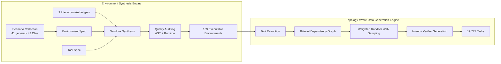

<div align="center">

# 🦀 ClawForge

**Synthesizing Executable Environments in Agentic RL for Claw-like Agents**

*Automated, sandbox-isolated, executable environments — and the scalable training data they power — for agentic reinforcement learning.*

[English](./README.md) · [简体中文](./README.zh-CN.md)

[](./LICENSE)
[](https://www.python.org/downloads/)
[](#-environment-taxonomy)
[](#-released-assets)
[](#-citation)

</div>

---

## 📖 Overview

**ClawForge** is an automated framework for synthesizing **executable environments** and **scalable training data** for Agentic Reinforcement Learning (RL). While existing synthetic environments are limited to isolated tool-calling endpoints, ClawForge targets **Claw-like agents** — persistent, system-level assistants that operate over stateful workspaces, file systems, databases, and terminal shells to complete long-horizon tasks.

ClawForge is built around two complementary engines:

| Engine | Role |
| --- | --- |
| 🏭 **Environment Synthesis Engine** | Expands natural-language scenarios into sandbox-isolated, executable environment packages with state, tool interfaces, documentation, and (for Claw environments) reusable `SKILL.md` guidance. |
| 🧭 **Topology-aware Data Generation Engine** | Models tool dependencies as intra- and cross-environment graphs, then samples valid tool chains and converts them into multi-turn user intents, initialized workspaces, and deterministic verifiers. |

The framework produces **139 interactive environments** and **19,777 tasks** spanning both Claw-specific and general tool-use settings. RL on this data yields gains of up to **+11.9%** on Claw-style benchmarks and **+8.0%** on general tool-use benchmarks, while cutting per-task inference token cost by up to **35%**.

---

## ✨ Highlights

- ✅ **Executable, not mocked** — real Python sandboxes with persistent state and deterministic transitions, not LLM-simulated responses.
- 🦀 **Claw-first design** — stateful workspaces, CLI-level Bash tools, cross-environment execution, and asynchronous task loops.
- 🕸️ **Topology-aware sampling** — tool chains are drawn as weighted random walks over a bi-level dependency graph, guaranteeing semantically coherent and logically valid tasks.
- 🎯 **Deterministic reward** — every task ships a programmatic verifier that audits the final workspace state, not a free-text judge.
- 📦 **Batteries included** — environments, task data, a full task-generation pipeline, and a vendored Uni-Agent + VERL training stack.
- 🧪 **Nine interaction archetypes** — transactional workspace, cross-tool pipeline, human-agent interaction, asynchronous events, constraint-guided state machines, temporal scheduling, bilateral matching, workflow orchestration, and fault-tolerant streaming.

---

## 🗂️ Table of Contents

1. [Overview](#-overview)
2. [Highlights](#-highlights)
3. [Architecture](#-architecture)
4. [Environment taxonomy](#-environment-taxonomy)
5. [Comparison with prior work](#-comparison-with-prior-work)
6. [Paper results](#-paper-results)
7. [Released assets](#-released-assets)
8. [Repository layout](#-repository-layout)
9. [Quick start](#-quick-start)
10. [Claw task format and reward](#-claw-task-format-and-reward)
11. [Regenerating Claw tool chains](#-regenerating-claw-tool-chains)
12. [Training with Uni-Agent and VERL](#-training-with-uni-agent-and-verl)
13. [Reproducibility notes](#-reproducibility-notes)
14. [Limitations](#-limitations)
15. [Citation](#-citation)
16. [License](#-license)
17. [Contributing](#-contributing)

---

## 🏗️ Architecture



The synthesis engine turns a scenario into a specification (`Espec` + `Tspec`), synthesizes an executable sandbox guided by a matched interaction archetype, and passes it through a dual-stage audit (static AST analysis + dynamic runtime testing). The data engine extracts the tool surface, builds a bi-level dependency graph, samples coherent tool chains, and reverse-engineers multi-turn user intents with deterministic verification scripts.

---

## 🗃️ Environment taxonomy

ClawForge contains **139 executable environments**, matching the environment inventory reported in the paper. The collection is deliberately split by agent setting rather than treating every Python module as a general tool-use environment:

| Paper category | Repository location | Count | Intended interaction setting |
| --- | --- | ---: | --- |
| General tool-use environments | [`ClawForge-Tool_env`](./ClawForge-Tool_env) root | **70** | Stateful Python environments with application-level tool interfaces |
| Claw-specific tool environments | [`ClawForge-Tool_env/claw`](./ClawForge-Tool_env/claw) | **30** | Claw-oriented, multi-step tool interaction patterns |
| Claw workspace environments | [`ClawForge-Claw_env`](./ClawForge-Claw_env) | **39** | CLI-first, persistent-workspace environments for long-horizon rollouts |
| **Total** | | **139** | **70 general + 69 Claw-specific environments** |

The **69 Claw-specific environments** comprise the 30 tool-interaction environments under `ClawForge-Tool_env/claw` and the 39 workspace environments under `ClawForge-Claw_env`. The latter contains **19** environments released with `SKILL.md` guidance and **20** released intentionally without it.

---

## ⚖️ Comparison with prior work

Unlike prior synthetic-environment frameworks that stop at application-level, generalist tool endpoints, ClawForge provides **stateful, workspace-level infrastructure** for training Claw-like agents at the largest task scale:

| Framework | # Envs | # Tasks | Claw support | Env domain | Stateful | Reward |
| --- | ---: | ---: | --- | --- | --- | --- |
| AutoForge (Cai et al. 2025) | 10 | 1,078 | ❌ | Consumer Web | DB Schema | LLM Judge |
| EnvScaler (Song et al. 2026) | 191 | 9,000 | ❌ | General | Class Attr. | Rule Check |
| ScaleEnv (Tu et al. 2026) | 16 | 2,560 | ❌ | General | DB Schema | Rule Check |
| AWM (Wang et al. 2026) | 1,000 | 10,000 | ❌ | General | DB Schema | Code & LLM |
| EnvFactory (Xu et al. 2026) | 85 | 2,575 | ❌ | General | DB Schema | Code Check |
| **ClawForge (Ours)** | **139** | **19,777** | ✅ | General | **Workspace** | Code Check |

---

## 📊 Paper results

The accompanying manuscript reports that RL on ClawForge data improves both Claw-style and general tool-use performance. Selected results are below; scores are percentages.

| Benchmark | Backbone | Base | ClawForge | Change |
| --- | --- | ---: | ---: | ---: |
| PinchBench | Qwen3-8B | 12.94 | 24.85 | **+11.91** |
| ClawEval | Qwen3-8B | 44.06 | 55.42 | **+11.36** |
| BFCL-v3 Multi-Turn | Qwen3.5-9B | 44.75 | 52.75 | **+8.00** |
| tau2-bench | Qwen3.5-9B | 27.64 | 36.28 | **+8.64** |

On PinchBench, ClawForge-Claw training also reduced average inference tokens for Qwen3-8B from **13.69K** to **8.84K** per task (up to ~35% reduction overall), indicating more efficient reasoning paths.

The manuscript reports a full audited corpus of **139 interactive environments** and **19,777 tasks**. The 139 environment implementations are organized in this repository according to the taxonomy above. The checked-in task data is the release snapshot described in the next section, so its task-record counts are reported separately from the paper-wide total.

---

## 📦 Released assets

| Asset | Contents in this repository snapshot |
| --- | --- |
| General tool-use environments | 70 Python modules at the root of [`ClawForge-Tool_env`](./ClawForge-Tool_env) |
| Claw-specific tool environments | 30 Python modules in [`ClawForge-Tool_env/claw`](./ClawForge-Tool_env/claw) |
| General tool-use data | 7,396 JSONL records in [`ClawForge-Tool_data.jsonl`](./ClawForge-Tool_data.jsonl), referencing 67 environment names |
| Claw workspace environments | 39 CLI-first packages in [`ClawForge-Claw_env`](./ClawForge-Claw_env): 19 with `SKILL.md` and 20 in `without_skill` |
| Claw workplace tasks | 991 manifest-complete task bundles across the 39 workspace environments in [`ClawForge-Claw_data`](./ClawForge-Claw_data) |
| Training integration | A vendored [Uni-Agent + VERL stack](./train_code/uni-agent) |

Each general tool-use record contains a user plan plus metadata such as the initial environment state, a deterministic validation protocol, a sampled tool chain, and scenario information. The checked-in Claw workplace tasks target the 39 CLI/workspace environments; each task is stored as a prompt, an environment builder, a task descriptor, and a code-only verifier.

The task [`manifest`](./ClawForge-Claw_data/_manifest.json) is the source of truth for task completeness. It records **five incomplete** generation entries in addition to the **991 complete** entries; downstream training should consume only complete task bundles.

---

## 🧱 Repository layout

```
ClawForge/
├── ClawForge-Tool_env/
│   ├── *.py                     # 70 general tool-use environments
│   └── claw/*.py                # 30 Claw-specific tool environments
├── ClawForge-Tool_data.jsonl    # General tool-use RL task records
├── ClawForge-Claw_env/          # 39 Claw workspace environments and synthesis utilities
│   ├── <environment>/           # 19 environment packages with README.md and SKILL.md
│   ├── without_skill/           # 20 environments intentionally released without SKILL.md
│   └── claw_chains/             # Tool extraction, graph building, task-generation pipeline
├── ClawForge-Claw_data/         # Native workplace task packages and manifest
│   ├── tasks/prompts/           # User-facing task prompts
│   ├── tasks/<task-id>/         # env_builder.py for each task
│   └── scripts/<task-id>/       # verify_workplace.py for deterministic reward
└── train_code/uni-agent/        # Uni-Agent / VERL integration and training recipes
```

---

## 🚀 Quick start

The environment assets themselves are predominantly Python standard-library code. **Python 3.10 or later** is recommended. The full training path additionally has the dependency and accelerator requirements documented by Uni-Agent and VERL.

List the commands supported by a representative Claw environment:

```bash
cd ClawForge-Claw_env
python -m logistics_envs.cli --help
```

Inspect a generated environment module from Python:

```python
import sys

sys.path.insert(0, "ClawForge-Tool_env")
from AutomotiveServiceRepairSystem import AutomotiveServiceRepairSystem

environment = AutomotiveServiceRepairSystem()
state = environment.get_env_state()
print(state.keys())
```

The detailed `README.md` within each Claw environment documents its domain state, available CLI verbs, scenario preparation, and concurrency checks. For examples, see [`logistics_envs`](./ClawForge-Claw_env/logistics_envs/README.md) and [`post_mails`](./ClawForge-Claw_env/post_mails/README.md).

---

## 🎁 Claw task format and reward

Every native workplace task follows this layout:

```
ClawForge-Claw_data/
├── tasks/prompts/<task-id>.md
├── tasks/<task-id>.yaml
├── tasks/<task-id>/env_builder.py
└── scripts/<task-id>/verify_workplace.py
```

At rollout time, the trainer creates a fresh workspace, runs `env_builder.py`, and lets the agent interact through file operations and Bash. The verifier then examines the resulting workspace and writes `workplace_score.json`. The reward is the verifier score normalized to the interval `[0, 1]`.

> 💡 This design prevents a task from being evaluated only by its final textual answer: the agent must leave the intended, checkable effect in the workspace.

---

## 🔁 Regenerating Claw tool chains

The [Claw pipeline](./ClawForge-Claw_env/claw_chains) includes:

| Stage | Script | Output |
| --- | --- | --- |
| Extract the shared and CLI tool surface | `extract_claw_tools.py` | `claw_tool_env_docs` |
| Build typed dependency graphs | `build_claw_graph.py` | `claw_tool_graphs` |
| Sample executable chains | `sample_claw_chains.py` | `claw_chains_out` |
| Generate task variants | `gen_claw_workplace_tasks.py` | `claw_workplace_tasks` |
| Expand task personas | `expand_task_personas.py` | persona-conditioned tasks |

A minimal deterministic chain-generation run is:

```bash
cd ClawForge-Claw_env/claw_chains
python extract_claw_tools.py
python build_claw_graph.py
python sample_claw_chains.py --n 8 --seed 0
```

Some enrichment steps can call an LLM through the optional client in `llm_client.py`. The chain extraction, graph construction, and sampling pipeline is designed to degrade to deterministic behavior when that client is unavailable. Consult the [pipeline documentation](./ClawForge-Claw_env/claw_chains/README.md) before generating a new release, especially for the gold-action and data-flow constraints enforced by the pipeline.

---

## 🏋️ Training with Uni-Agent and VERL

The repository contains a Uni-Agent checkout with a native Claw dataset loader, reward function, smoke test, and a GRPO/DAPO-style launcher. Training is intended for a dedicated Linux machine with Bash, pexpect, Ray, VERL, and suitable accelerator support.

The integration expects the Claw environment directory to be visible to Uni-Agent as `claw_envs`. On a Linux host, the following creates a non-copying compatibility link:

```bash
cd train_code/uni-agent
ln -s ../../ClawForge-Claw_env claw_envs
```

Then use absolute paths when configuring the included launcher:

```bash
export REPO_ROOT=/absolute/path/to/ClawForge
export UNI_AGENT_DIR="$REPO_ROOT/train_code/uni-agent"
export VERL_DIR="$UNI_AGENT_DIR/verl/verl_0720_2"
export CLAW_TASKS_DIR="$REPO_ROOT/ClawForge-Claw_data"
export CLAW_TOOL_DOCS_DIR="$REPO_ROOT/ClawForge-Claw_env/claw_chains/claw_tool_env_docs"
export CLAW_AGENT_CONFIG="$UNI_AGENT_DIR/examples/claw_envs/agent_config.yaml"
export CLAW_FORMAT=without_skill

cd "$UNI_AGENT_DIR"
python examples/claw_envs/smoke_test.py --repo-root "$UNI_AGENT_DIR"
```

For a full RL launch, review and adapt [`run_claw_dapo.sh`](./train_code/uni-agent/examples/claw_envs/run_claw_dapo.sh) and the accompanying [training README](./train_code/uni-agent/examples/claw_envs/README.md). In particular, configure `MODEL_PATH`, hardware parallelism, output directories, and the VERL installation for your cluster.

> ⚠️ **Safety note:** native Claw rollouts execute commands on the host rather than inside a container. Run only trusted tasks and models on an isolated training machine. The bundled launcher also stops Ray processes and clears its configured Ray temporary directory; inspect it before executing it on a shared machine.

---

## 🔬 Reproducibility notes

The paper trains Qwen3 and Qwen3.5 models with GRPO in VERL. Its primary experiments use Claw-specialized data, a rollout batch size of 64, a 32K-token generation limit, and up to 64 action turns. These settings are experiment-level references, not hardware-independent defaults; the bundled launcher should be scaled to the available model, accelerator, and memory budget.

For the local task runtime, see:

- [Workplace rollout README](./train_code/uni-agent/examples/claw_envs/README.md)
- [Native dataset guide](./train_code/uni-agent/examples/claw_envs/NATIVE_DATASET.md)
- [Training launcher](./train_code/uni-agent/examples/claw_envs/run_claw_dapo.sh)
- [Environment-package design recipe](./ClawForge-Claw_env/claw_env_recipe.md)

---

## ⚠️ Limitations

- All environments are synthetic research artifacts, not production integrations.
- The repository does not distribute base models, model checkpoints, API credentials, or external services.
- The full manuscript-scale corpus and the checked-in release snapshot have different counts; use the manifest and file layout in this repository when reproducing a release-level experiment.
- Generated examples may resemble operational domains such as finance, healthcare, human resources, security, or travel, but they are not suitable for real-world decision making.

---

## 📝 Citation

The accompanying manuscript is currently an **anonymous submission**. Please cite the public paper version once bibliographic metadata and a permanent URL are released. This section will be updated with the canonical BibTeX entry at that time.

---

## 📄 License

This repository is released under the [Apache License 2.0](./LICENSE). Please preserve applicable notices when redistributing third-party components, including the vendored Uni-Agent and VERL code. Users are responsible for ensuring that their intended use of generated datasets and any downstream data complies with applicable requirements.

---

## 🤝 Contributing

Issues and pull requests are welcome. When contributing a new environment or task, please include:

1. Clear environment documentation and typed tool/CLI descriptions;
2. Deterministic state initialization and verification;
3. A scenario or smoke test;
4. No real credentials, personal data, or production endpoints.

---

<div align="center">

*Made for the agentic-RL community — forge your own environments.* 🦀⚒️

</div>
