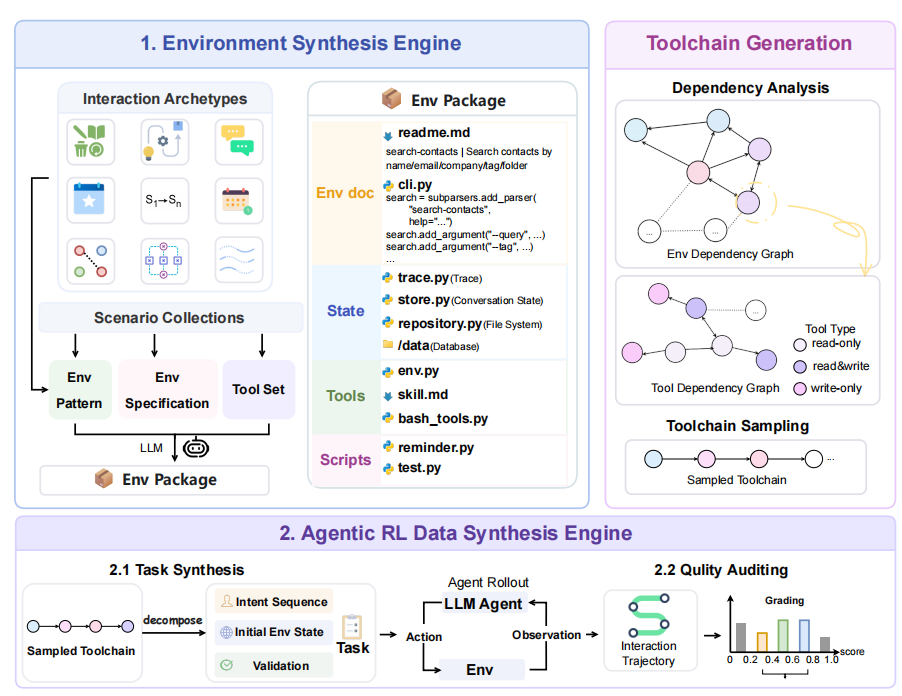

<div align="center">

# 🦀 ClawForge

**ClawForge：在智能体强化学习中合成可执行环境，用于 Claw 类智能体**

*为智能体强化学习（Agentic RL）自动化合成沙箱隔离的可执行环境，及其支撑的大规模训练数据。*

[English](./README.md) · [简体中文](./README.zh-CN.md)

[](./LICENSE)
[](https://www.python.org/downloads/)
[](#-环境分类)
[](#-发布资产)
[](#-引用)

</div>

---

## 📖 概述

**ClawForge** 是一个面向智能体强化学习（Agentic RL）的自动化框架，用于合成**可执行环境**与**大规模训练数据**。现有的合成环境大多局限于孤立的工具调用端点，而 ClawForge 面向 **Claw 类智能体**——即在有状态的工作区、文件系统、数据库和终端 shell 上执行长程任务的、持续运行的系统级助手。

ClawForge 由两个互补的引擎构成：

| 引擎 | 作用 |
| --- | --- |
| 🏭 **环境合成引擎** | 将自然语言场景扩展为沙箱隔离、可执行的环境包，包含状态、工具接口、文档，以及（针对 Claw 环境）可复用的 `SKILL.md` 引导。 |
| 🧭 **拓扑感知的数据生成引擎** | 将工具依赖建模为环境内与环境间的依赖图，采样合法的工具链，并将其转化为多轮用户意图、初始工作区与确定性验证器。 |

该框架产出 **139 个交互式环境**与 **19,777 个任务**，覆盖 Claw 专用与通用工具使用两类场景。在这些数据上进行强化学习，在 Claw 类基准上最高提升 **+11.9%**、在通用工具使用基准上最高提升 **+8.0%**，同时将每个任务的推理 token 开销最多降低 **35%**。

---

## ✨ 亮点

- ✅ **真正可执行，而非模拟** —— 真实的 Python 沙箱，具备持久状态与确定性状态转移，而非由 LLM 模拟的响应。
- 🦀 **Claw 优先的设计** —— 有状态工作区、CLI 级 Bash 工具、跨环境执行与异步任务循环。
- 🕸️ **拓扑感知采样** —— 工具链通过在双层依赖图上的带权随机游走生成，保证语义连贯、逻辑合法的任务。
- 🎯 **确定性奖励** —— 每个任务都附带程序化验证器，审计最终工作区状态，而非自由文本评判。
- 📦 **开箱即用** —— 环境、任务数据、完整的任务生成流水线，以及内置的 Uni-Agent + VERL 训练栈。
- 🧪 **九种交互原型** —— 事务型工作区、跨工具流水线、人机交互、异步事件、约束引导状态机、时序调度、双边匹配、工作流编排与容错流处理。

---

## 🗂️ 目录

1. [概述](#-概述)
2. [亮点](#-亮点)
3. [架构](#-架构)
4. [环境分类](#-环境分类)
5. [与既有工作的对比](#-与既有工作的对比)
6. [论文结果](#-论文结果)
7. [发布资产](#-发布资产)
8. [仓库结构](#-仓库结构)
9. [快速开始](#-快速开始)
10. [Claw 任务格式与奖励](#-claw-任务格式与奖励)
11. [重新生成 Claw 工具链](#-重新生成-claw-工具链)
12. [使用 Uni-Agent 与 VERL 训练](#-使用-uni-agent-与-verl-训练)
13. [可复现性说明](#-可复现性说明)
14. [局限性](#-局限性)
15. [引用](#-引用)
16. [许可证](#-许可证)
17. [贡献](#-贡献)

---

## 🏗️ 架构



> **图 3：环境与任务合成流水线。** 给定自然语言描述，环境合成引擎生成可执行沙箱（状态 + 工具 + 文档）；数据合成引擎采样工具链并合成强化学习任务。

合成引擎首先将场景转化为规格（`Espec` + `Tspec`），在匹配到的交互原型引导下合成可执行沙箱，再经过双阶段审计（静态 AST 分析 + 动态运行时测试）。数据生成引擎抽取工具面、构建双层依赖图、采样连贯的工具链，并逆向生成多轮用户意图与确定性验证脚本。

---

## 🗃️ 环境分类

ClawForge 包含 **139 个可执行环境**，与论文报告的环境清单一致。该集合刻意按智能体场景划分，而非将每个 Python 模块都视为通用工具使用环境：

| 论文分类 | 仓库位置 | 数量 | 预期的交互场景 |
| --- | --- | ---: | --- |
| 通用工具使用环境 | [`ClawForge-Tool_env`](./ClawForge-Tool_env) 根目录 | **70** | 具备应用级工具接口的有状态 Python 环境 |
| Claw 专用工具环境 | [`ClawForge-Tool_env/claw`](./ClawForge-Tool_env/claw) | **30** | 面向 Claw 的多步工具交互模式 |
| Claw 工作区环境 | [`ClawForge-Claw_env`](./ClawForge-Claw_env) | **39** | 面向长程 rollout 的 CLI 优先、持久工作区环境 |
| **合计** | | **139** | **70 个通用 + 69 个 Claw 专用环境** |

**69 个 Claw 专用环境**由 `ClawForge-Tool_env/claw` 下的 30 个工具交互环境与 `ClawForge-Claw_env` 下的 39 个工作区环境组成。后者包含 **19** 个附带 `SKILL.md` 引导的环境，以及 **20** 个有意不附带 `SKILL.md` 发布的环境。

---

## ⚖️ 与既有工作的对比

与止步于应用级、通用工具端点的既有合成环境框架不同，ClawForge 以最大的任务规模，为 Claw 类智能体训练提供了**有状态、工作区级的基础设施**：

| 框架 | 环境数 | 任务数 | Claw 支持 | 环境域 | 有状态 | 奖励 |
| --- | ---: | ---: | --- | --- | --- | --- |
| AutoForge (Cai et al. 2025) | 10 | 1,078 | ❌ | 消费 Web | 数据库 Schema | LLM 评判 |
| EnvScaler (Song et al. 2026) | 191 | 9,000 | ❌ | 通用 | 类属性 | 规则校验 |
| ScaleEnv (Tu et al. 2026) | 16 | 2,560 | ❌ | 通用 | 数据库 Schema | 规则校验 |
| AWM (Wang et al. 2026) | 1,000 | 10,000 | ❌ | 通用 | 数据库 Schema | 代码 + LLM |
| EnvFactory (Xu et al. 2026) | 85 | 2,575 | ❌ | 通用 | 数据库 Schema | 代码校验 |
| **ClawForge（本文）** | **139** | **19,777** | ✅ | 通用 | **工作区** | 代码校验 |

---

## 📊 论文结果

论文报告在 ClawForge 数据上进行强化学习能同时提升 Claw 类与通用工具使用性能。以下为部分结果，分数均为百分比：

| 基准 | 主干模型 | 基线 | ClawForge | 提升 |
| --- | --- | ---: | ---: | ---: |
| PinchBench | Qwen3-8B | 12.94 | 24.85 | **+11.91** |
| ClawEval | Qwen3-8B | 44.06 | 55.42 | **+11.36** |
| BFCL-v3 Multi-Turn | Qwen3.5-9B | 44.75 | 52.75 | **+8.00** |
| tau2-bench | Qwen3.5-9B | 27.64 | 36.28 | **+8.64** |

在 PinchBench 上，ClawForge-Claw 训练还将 Qwen3-8B 的平均推理 token 数从每个任务 **13.69K** 降至 **8.84K**（整体最多降低约 35%），表明推理路径更加高效。

论文报告了一个经审计的完整语料：**139 个交互式环境**与 **19,777 个任务**。这 139 个环境实现按上述分类在本仓库中组织。已入库的任务数据是下一节所述的发布快照，因此其任务记录数量与论文全量总数分开报告。

---

## 📦 发布资产

| 资产 | 本仓库快照中的内容 |
| --- | --- |
| 通用工具使用环境 | [`ClawForge-Tool_env`](./ClawForge-Tool_env) 根目录下的 70 个 Python 模块 |
| Claw 专用工具环境 | [`ClawForge-Tool_env/claw`](./ClawForge-Tool_env/claw) 下的 30 个 Python 模块 |
| 通用工具使用数据 | [`ClawForge-Tool_data.jsonl`](./ClawForge-Tool_data.jsonl) 中的 7,396 条 JSONL 记录，引用 67 个环境名 |
| Claw 工作区环境 | [`ClawForge-Claw_env`](./ClawForge-Claw_env) 中的 39 个 CLI 优先包：19 个附带 `SKILL.md`，20 个在 `without_skill` 中 |
| Claw 工作区任务 | [`ClawForge-Claw_data`](./ClawForge-Claw_data) 中跨 39 个工作区环境的 991 个清单完备的任务包 |
| 训练集成 | 内置的 [Uni-Agent + VERL 训练栈](./train_code/uni-agent) |

每条通用工具使用记录包含一个用户计划，以及初始环境状态、确定性验证协议、采样工具链、场景信息等元数据。已入库的 Claw 工作区任务面向 39 个 CLI/工作区环境；每个任务以提示、环境构建器、任务描述符与纯代码验证器的形式存储。

---

## 🧱 仓库结构

```
ClawForge/
├── ClawForge-Tool_env/
│   ├── *.py                     # 70 个通用工具使用环境
│   └── claw/*.py                # 30 个 Claw 专用工具环境
├── ClawForge-Tool_data.jsonl    # 通用工具使用 RL 任务记录
├── ClawForge-Claw_env/          # 39 个 Claw 工作区环境与合成工具
│   ├── <environment>/           # 19 个附带 README.md 与 SKILL.md 的环境包
│   ├── without_skill/           # 20 个有意不附带 SKILL.md 的环境
│   └── claw_chains/             # 工具抽取、图构建、任务生成流水线
├── ClawForge-Claw_data/         # 原生工作区任务包与清单
│   ├── tasks/prompts/           # 面向用户的任务提示
│   ├── tasks/<task-id>/         # 每个任务的 env_builder.py
│   └── scripts/<task-id>/       # 用于确定性奖励的 verify_workplace.py
└── train_code/uni-agent/        # Uni-Agent / VERL 集成与训练配方
```

---

## 🚀 快速开始

环境资产本身主要是 Python 标准库代码。建议使用 **Python 3.10 或更高版本**。完整训练路径还额外依赖 Uni-Agent 与 VERL 所记录的依赖与加速器要求。

查看一个代表性 Claw 环境所支持的命令：

```bash
cd ClawForge-Claw_env
python -m logistics_envs.cli --help
```

从 Python 检查一个生成的环境模块：

```python
import sys

sys.path.insert(0, "ClawForge-Tool_env")
from AutomotiveServiceRepairSystem import AutomotiveServiceRepairSystem

environment = AutomotiveServiceRepairSystem()
state = environment.get_env_state()
print(state.keys())
```

每个 Claw 环境内的详细 `README.md` 记录了其领域状态、可用的 CLI 动词、场景准备与并发检查。示例见 [`logistics_envs`](./ClawForge-Claw_env/logistics_envs/README.md) 与 [`post_mails`](./ClawForge-Claw_env/post_mails/README.md)。

---

## 🎁 Claw 任务格式与奖励

每个原生工作区任务都遵循以下结构：

```
ClawForge-Claw_data/
├── tasks/prompts/<task-id>.md
├── tasks/<task-id>.yaml
├── tasks/<task-id>/env_builder.py
└── scripts/<task-id>/verify_workplace.py
```

在 rollout 时，训练器创建全新工作区、运行 `env_builder.py`，并让智能体通过文件操作与 Bash 进行交互。随后验证器检查最终工作区并写入 `workplace_score.json`。奖励为验证器分数归一化到 `[0, 1]` 区间的值。

> 💡 这一设计避免了任务仅凭最终文本答案被评判：智能体必须在工作区中留下预期的、可被检查的效果。

---

## 🔁 重新生成 Claw 工具链

[Claw 流水线](./ClawForge-Claw_env/claw_chains)包含：

| 阶段 | 脚本 | 输出 |
| --- | --- | --- |
| 抽取共享与 CLI 工具面 | `extract_claw_tools.py` | `claw_tool_env_docs` |
| 构建类型化依赖图 | `build_claw_graph.py` | `claw_tool_graphs` |
| 采样可执行工具链 | `sample_claw_chains.py` | `claw_chains_out` |
| 生成任务变体 | `gen_claw_workplace_tasks.py` | `claw_workplace_tasks` |
| 扩展任务画像 | `expand_task_personas.py` | 按画像条件化的任务 |

最小化的确定性工具链生成流程为：

```bash
cd ClawForge-Claw_env/claw_chains
python extract_claw_tools.py
python build_claw_graph.py
python sample_claw_chains.py --n 8 --seed 0
```

部分扩充步骤可通过 `llm_client.py` 中的可选客户端调用 LLM。工具链抽取、图构建与采样流水线被设计为在客户端不可用时降级为确定性行为。在生成新发布版本之前，请查阅[流水线文档](./ClawForge-Claw_env/claw_chains/README.md)，尤其是流水线强制执行的 gold-action 与数据流约束。

---

## 🏋️ 使用 Uni-Agent 与 VERL 训练

仓库包含一个 Uni-Agent 检出，内置原生 Claw 数据集加载器、奖励函数、冒烟测试，以及 GRPO/DAPO 风格的启动器。训练面向配备 Bash、pexpect、Ray、VERL 与合适加速器的专用 Linux 机器。

该集成期望 Claw 环境目录以 `claw_envs` 名称对 Uni-Agent 可见。在 Linux 主机上，以下命令可创建一个不复制文件的兼容链接：

```bash
cd train_code/uni-agent
ln -s ../../ClawForge-Claw_env claw_envs
```

然后在配置内置启动器时使用绝对路径：

```bash
export REPO_ROOT=/absolute/path/to/ClawForge
export UNI_AGENT_DIR="$REPO_ROOT/train_code/uni-agent"
export VERL_DIR="$UNI_AGENT_DIR/verl/verl_0720_2"
export CLAW_TASKS_DIR="$REPO_ROOT/ClawForge-Claw_data"
export CLAW_TOOL_DOCS_DIR="$REPO_ROOT/ClawForge-Claw_env/claw_chains/claw_tool_env_docs"
export CLAW_AGENT_CONFIG="$UNI_AGENT_DIR/examples/claw_envs/agent_config.yaml"
export CLAW_FORMAT=without_skill

cd "$UNI_AGENT_DIR"
python examples/claw_envs/smoke_test.py --repo-root "$UNI_AGENT_DIR"
```

要进行完整的 RL 启动，请审阅并调整 [`run_claw_dapo.sh`](./train_code/uni-agent/examples/claw_envs/run_claw_dapo.sh) 及配套的[训练 README](./train_code/uni-agent/examples/claw_envs/README.md)。尤其需要针对你的集群配置 `MODEL_PATH`、硬件并行度、输出目录与 VERL 安装。

> ⚠️ **安全说明：** 原生 Claw rollout 在宿主机上执行命令，而非容器内。请仅在隔离的训练机上运行可信的任务与模型。内置启动器还会停止 Ray 进程并清理其配置的 Ray 临时目录；在共享机器上执行前请先检查。

---

## 🔬 可复现性说明

论文使用 VERL 中的 GRPO 训练 Qwen3 与 Qwen3.5 模型。其主要实验使用 Claw 专用数据、64 的 rollout 批大小、32K token 的生成上限，以及最多 64 个动作轮次。这些设置是实验级参考，而非与硬件无关的默认值；内置启动器应根据可用的模型、加速器与显存预算进行伸缩。

关于本地任务运行时，请参见：

- [工作区 rollout README](./train_code/uni-agent/examples/claw_envs/README.md)
- [原生数据集指南](./train_code/uni-agent/examples/claw_envs/NATIVE_DATASET.md)
- [训练启动器](./train_code/uni-agent/examples/claw_envs/run_claw_dapo.sh)
- [环境包设计配方](./ClawForge-Claw_env/claw_env_recipe.md)

---

## ⚠️ 局限性

- 所有环境均为合成研究产物，而非生产级集成。
- 论文全量语料与已入库的发布快照在数量上不同；复现发布级实验时请以本仓库的清单与文件结构为准。
- 生成的示例可能涉及金融、医疗、人力资源、安全或出行等领域，但不适合用于真实世界的决策。

---

## 📝 引用

随附论文目前为**匿名投稿**。待书目元数据与永久 URL 发布后，请引用公开的论文版本。届时本节将更新为规范的 BibTeX 条目。

---

## 📄 许可证

本仓库依据 [Apache License 2.0](./LICENSE) 发布。在再分发第三方组件（包括内置的 Uni-Agent 与 VERL 代码）时，请保留相应声明。用户有责任确保其预期用途中的生成数据集及任何下游数据符合适用要求。

---

## 🤝 贡献

欢迎提交 Issue 与 Pull Request。贡献新环境或任务时，请包含：

1. 清晰的环境文档与类型化的工具/CLI 描述；
2. 确定性的状态初始化与验证；
3. 一个场景或冒烟测试；
4. 不包含真实凭证、个人数据或生产端点。

---

<div align="center">

*为智能体强化学习社区打造 —— 铸造你自己的环境。* 🦀⚒️

</div>
